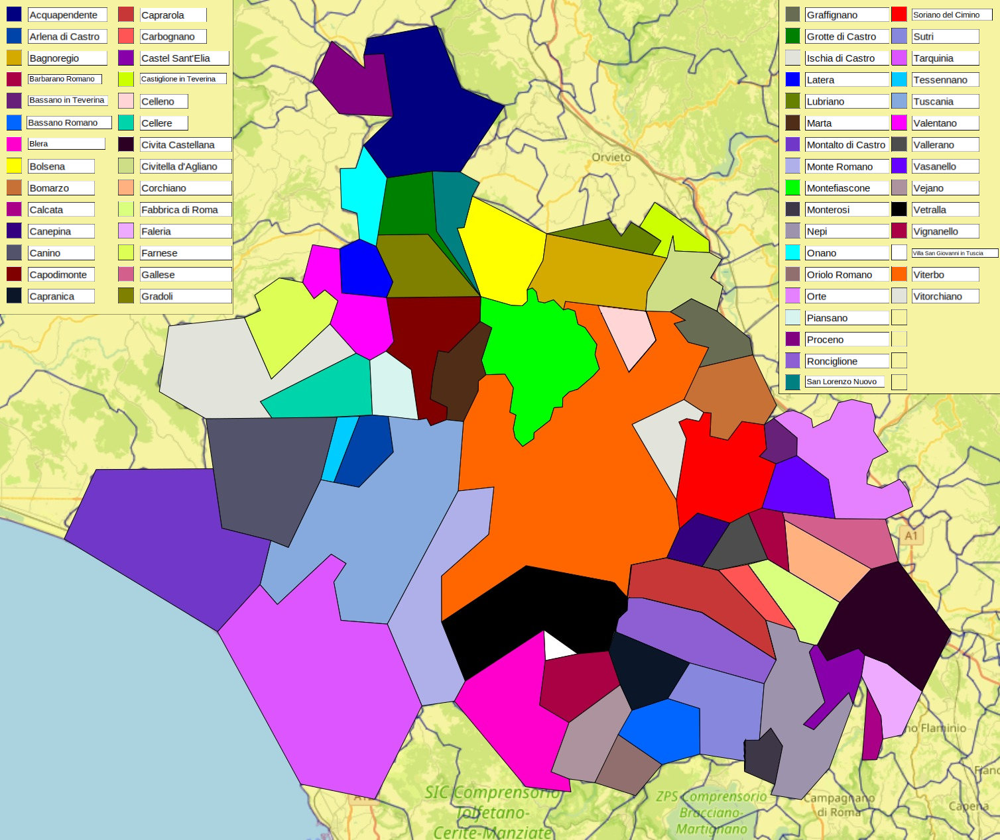

# ⚠️ANNUNCIO IMPORTANTE⚠️ (o anche, lo spiegone)

#ETRURIANWAR, la guerra targata Memacci che decreterà il comune più forte della Provincia.

## COME FUNZIONA?

Si parte dai 60 comuni della provincia di Viterbo (da oggi Etruria, dispiace per gli orvietani).
Ogni comune è un regno autonomo che decide di fare la guerra agli altri per conquistare la Tuscia.
Ogni comune può attaccare soltanto uno dei comuni confinanti. Se vince ingloba il territorio, se perde resta tutto come è. 
Poi può succedere anche che un comune attacchi un territorio che era già stato conquistato (tipo Montefiascone attacca Viterbo che era già stato conquistato da vetralla. Montefiascone vince. Vetralla passerà quindi da due territori a uno, mentre Montefiascone da uno a due). Insomma, credeteci, sarà tutto più facile quando lo vedrete.

## CHI LO DECIDE?
“A cazzo di cane”. Cioè sarà tutto casuale.
Grazie ai potenti mezzi del dottor Memacci e al suo quantum computer al plutonio, XRL2500 BucioDeCulo, sarà il caso a decidere quale comune attaccherà per primo, se vincerà e se no. 

Ci sono alcuni parametri che incideranno sulla battaglia (tipo la forza del saettone, la spada del pesciarolo, l’esercito dell’ente maremma) ma li scoprirete man mano.

In linea con la filosofia del "chi mena pe primo mena du volte" piu' territori c'hai piu' meni e difendi bene.

I combattimenti saranno casuali e due volte al giorno (alle 12.00 e alle 20.00).

Comunicheremo i risultati aggiornando di volta in volta i colori della mappa.

## CHI VINCE?

Vince chi conquista tutti i territori. Si accettano scommesse.
Il comune campione prenderà il titolo di “protettore della Tuscia” e tutti gli altri ce dovranno sta.
Insomma, ripeto. È più complicato a dirsi che a farsi. Sarà una guerra lunga e sanguinosa e noi nel frattempo continueremo a memare.

Grazie per l’attenzione,

Il dottor. Memacci e il consiglio tutto.